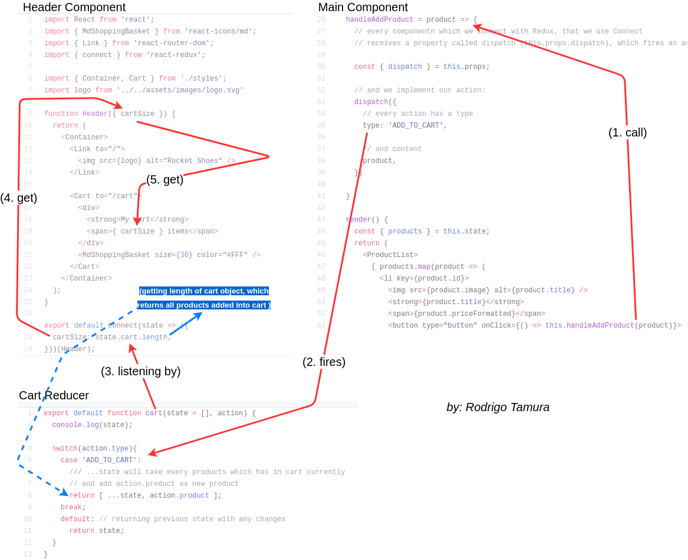
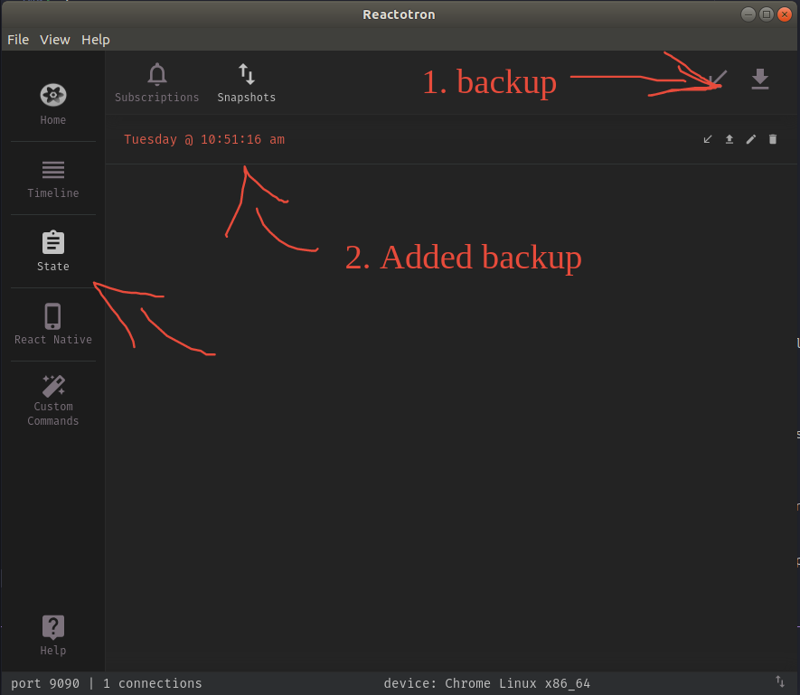
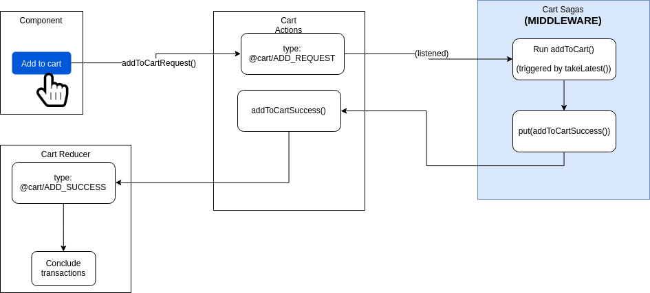
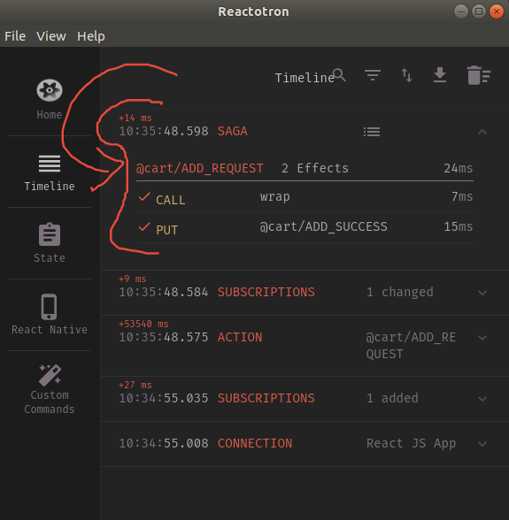

# Introduction

You can see more details [here](./1562597351733.pdf). Bellow we going to note some details in a nutshell.

Flux is an architeture implemented by lib called **Redux** working with ReactJS and React Native, Angular or any front-end JS projects.

Flux is a manner of communication among elements in a display, and controlling of global states. Global States does not have an owner.

When we have a state or data which do not have a unique owner and it is handled by many components it is indicated to use Flux architeture.

### Principles to use Redux

- Every action must have a **type** (unique type name) for each action which we want to manipulate the state;
- The state must be in Redux, we can not store half of an state in Redux and another part of this state in component;
- We must not mutate a state of Redux without an action (like a component state);
- Action and reducer must not make any side-effect assyncronous works (API requests, call a DB). It is a concept of a **pure function** which we can call it and always it will returns the same results;
- Any syncronous logics and business rules must be in a reducer and NEVER in an action;
- **Not every application needs Redux, start without it and feel the necessity to implement it after.**.

# About the project

In order to implement Flux Architeture, we will develop a sample of an e-commerce using ReactJS and Redux and approach the most important datails of this architeture and lib.

The project can be accessed in [here](./project/), however in this README we going to note the details the implementations.

### Don't you remember how to create a new ReactJS project?

`$ yarn create react-app project`

And afterwards configure ESlint, Prettier, EditoConfig. Don't you remember? No prob, [click here](https://github.com/rodrigotamura/go-stack-2019/tree/master/module03/react-first-project#eslint-prettier-and-editorconfig).

# Special details about routes

Basically we import **BrowserRoute** to use inside at routes.js. We will import it inside [App.js](./project/src/App.js), and implement `<BrowserRouter>` there instead at router.js.

Btu why are we including at [App.js](./project/src/App.js)? Because we want to have a default HEADER that will be used in whole project. Within HEADER we will implement cart feature and navigation. Important is that HEADER must be a child of <BrowserRoute>:

```javascript
function App() {
  return (
    <BrowserRouter>
      <Header />
      <Routes />
    </BrowserRouter>
  );
}
```

# Polished

Polished is a library that deal with colors in JS. It could lighten or darken a color, add opcity, and so on.

We want to darken a button whem is is hover ([see here an example](./src/components/Home/styles.js)).

# API with JSON Server

We will consume one API in order to populate our shoes object using [JSON Server](https://github.com/typicode/json-server) that is a full fake REST API with zero coding in less than 30 seconds (seriously). Created with <3 for front-end developers who need a quick back-end for prototyping and mocking.

`$ yarn global add json-server`

We will create the file [server.json](./project/server.json). It provides two routes: stock and products.

Run `$ json-server server.json -p 3333 -w`
(`-w` flag is live reload, if we change server.json)

Noew we have a fake API using JSON Server accessing `http://localhost:3333/`.

And we will user Axios for API sonsuming [/src/services/api.js](./project/src/services/api.js)

### JSON-SERVER and React Native

If you are in a React Native project, running your app on USB and trying to use JSON-SERVER, you need to set Axios's baseURL to yout machine's host IP and run `$ json-server --host <your-ip> server.js -p 3333`

# Internationalization (i18n)

Working with listing of products, we can realize that the price is not formatted.

Let's format it based on the locale setted in our project.

Create [/src/util/format.js](./project/src/util/format.js) and it will contain the format functions.

(Note that **/src/utils/** we will store every function that is usefu for all application).

And we will use at [Home Page](./project/src/pages/Home/index.js).

# Configuring Redux

Let's install a package that will integrate Redux with React: `$ yarn add redux react-redux`.

Create:

- /src/store -> this folder will stores every Redux files;
- [/src/store/index.js](./project/src/store/index.js) -> Initial config for Redux. Open this file for further details.

Import **react-redux** within [App.js](./project/src/App.js).

**If you see an error** it means that you need to create a new Reducer function at [/src/store/index.js](./project/src/store/index.js). In this project we will create `cart()` reducer where the state will be an empty array.

Let's create some others folders and file:

- /src/store/modules/ -> we can create many modules, or many type of data we can store in Redux.
- [/src/store/modules/cart/reducer.js](./project/src/store/modules/cart/reducer.js) -> we will create `cart` reducer.

NOTE: FOR ORGANIZATION we will not create the reducers directly in [/src/store/index.js](./project/src/store/index.js), we will separate in differents modules at /src/store/modules/\* and import them there.

We can create a reducer for cart, reducer for users' information, reducer for anything.

However if we want to create another reducers, we need firstly create [/src/src/store/modules/rootReducer.js](./project/src/src/store/modules/rootReducer.js). Open this file in order to understand how would we include more than one reducers.

`CombineReducers` will combine many reducers at once.

Finally we import `rootReducer.js` into [/src/store/index.js](./project/src/store/index.js)

# Using reducer - Adding produts into cart

When user click on 'Add to cart' for a specific product, all information about this product will be added into cart reducer. And this cart reducer will be accessible in while application.

1. Firstly we need to import a connector to redux in the component (see further details at [/src/pages/Main/index.js](./project/src/pages/Main/index.js)). `import { connect } from 'react-redux';`;
2. Remove `export default` from Home Component;
3. On last line, put `export default connect()(Home)`;

Now, let's implement the action throwing at the button of add to cart from a product:

```javascript
handleAddProduct = product => {
  // every componentn which we connect with Redux, that we use Connect
  // receives a property called dispatch (this.props.dispatch), which fires an action into Redux

  const { dispatch } = this.props;

  // and we implement our action:
  dispatch({
    // every action has a type
    type: 'ADD_TO_CART',

    // and content
    product,
  })

}

{ products.map(product => (
  // [ ... ]
  <button type="button" onClick={() => this.handleAddProduct(product)}>
}
```

Now, open [Cart Reducer](./project/src/store/modules/cart/reducer.js) and if you implement some `console.log('something')` and press the button, you will realize that the `cart()` reducer is firing. So, how Cart Reducer is firing? It's because **`dispatch` will execute every reducers configured in our application**.

And, Cart Reducer receives two variables: **state** and **action** that we get the properties which we sent by `dispatch()`.

- action: will come with `type` and the content of `product`;
- state: is the previous state is the current state from the reducer. If Cart Reduces does not have any data yet, state will be an empty array.

**Remembering that STATE in Reat is immutable**, the STATE from Redux is immutable as well.

**Every reducer will have similar code**. Open [Cart Reducer](./project/src/store/modules/cart/reducer.js) to see this implementation.

### Accessing states from Redux

1. Let's open [Header Component](./project/src/components/Header/index.js), import Connect object:

```javascript
import { connect } from "react-redux";
```

2. Remove `export default` from Header Component;
3. On last line, put `export default connect()(Heder)`;
4. We will set some properties now:

```javascript
export default connect(
  // retrieving a state we need in this component
  // and we need to return it in object format (that's why we return with ({}) )
  state => ({
    // state.cart => 'cart' is the name of reducer we want to access to (see rootReducer.js)
    cart: state.cart
  })
)(Heder);
```

5. Add 'cart' property within Header Component:

```javascript
function Header({ cart }) {
  console.log(cart); // implementing it to test if we are really getting from Redux State
}
```

So, **every component which has _connect_**, and some changing occurs with some state, this component will be rendered again with new states.

What is happening is something like the follow schema:



# Reactotron and Redux

Notice: You need [Reactotron Desktop](https://github.com/infinitered/reactotron). Install it and continue...

### Installing Reactottron in our project

Let's install reactotron package and reactotron-redux for redux integration:

`$ yarn add reactotron-react-js reactotron-redux`

Now, create [/src/config/ReactotronConfig.js](./project/src/config/ReactotronConfig.js) and open it for further details of this implementation.

Add this new rule into [/.eslintrc.js](./.eslintrc.js), because probably `console.tron` is showing some error by ESLint:

```javascript
rules: {
  'prettier/prettier': 'error',
  'react/jsx-filename-extension': ['warn', { extensions: ['.jsx', '.js'] }],
  'import/prefer-default-export': 'off',
  'no-console': ['error', { allow: ['tron'] }],
},
```

### Integrating Reactotron with Redux

Open [/src/store/index.js](./project/src/store/index.js) and add:

```javascript
const enhancer =
  process.env.NODE_ENV === "development" ? console.tron.createEnhancer() : null;
```

Add `enhancer` as the second parameter into `store`:

```javascript
//                                        \/
const store = createStore(rootReducer, enhancer);
```

Now import `ReactotronConfig` into [App.js](./project/src/App.js), and Reactotron is totally integrated with ReactJS and Redux.

### Reactotron with Redux tips

**Tip 1:**
At Reactotron Desktop you will see State menu, where you can create subscription. In this subscription we put a name of a reducer (for a while we only have `cart` - or `cart[1].title`) and Reactotron will start to listen to this reducer.

**Tip 2:**
When the application's page is reloaded, it will lost all Redux States (of course, if you not implemented some feature to persist this data). And during development we are frequently reloading the application and losing the states.

Reactotron Desktop has a feature that we can backup the current state with its values and properties and restore them anytime.


Backuping current state of reducers


Restoring snapshot

# Immer

Immer is a tool that simplify to deal with immutable objects and arrays in React.

Till now we are working with immutability with states. When we are "updating" a state, by adding a new item into it for example, we are indeed creating a new array, because we are doing:

```javascript
this.setState({
  items: [...itemsOld, itemNew]
});
```

With Immer we have something like middle of immutability and mutability. So, we might take the actual state, making some modifications over a draft created from the previous state and finally our modifications are applyed on our main state.

We could use, for example, push functions along with Immer. It will avoid to use spread operators (...) to manage states.

Install Immer: `$ yarn add immer` and open [/src/store/modules/cart/reducer.js](./project/src/store/modules/cart/reducer.js) to see the implementations and further explanations of Immer.

# Refactoring the actions (dispatches)

A good practice is to separate the actions (`ADD_TO_CART`, `REMOVE_TO_CART`) from components to another files, because each action is associated with a module of our application.

`ADD_TO_CART` and `REMOVE_TO_CART` are associated with [Cart Reducer](./project/src/store/modules/cart/reducer.js).

So, we will create [/src/store/modules/cart/actions.js](./project/src/store/modules/cart/actions.js). Let's cut each dispatch content and paste into this new script. And finally we can simply import the functions within each component which are using them.

Another way to use the created actions in [/src/store/modules/cart/actions.js](./project/src/store/modules/cart/actions.js) is importing **bindActionCreators** from Redux package:

```javascript
import { bindActionCreators } from "redux";
import * as CartActions from "../../store/modules/cart/actions";
```

And, at the end of the component we will create:

```javascript
const mapDispatchToProps = dispatch =>
  bindActionCreators(CartActions, dispatch);

export default connect(
  null,
  mapDispatchToProps
)(Home);

// null if we had mapStateToProps
```

This function, like mapStateToProps (convert States to Properties), it will convert actions of Redux to component props.

Now we can use the actions addToCart and removeFromCart directly in component props:

```javascript
handleAddProduct = product => {
  const { addToCart } = this.props;

  addToCart(product);
};
```

It is a good practice to identify which reducer the actions belongs to. For example, `ADD_TO_CART` belongs to _Cart Reducer_, so, we will convert to **@cart/ADD_TO_CART**, or simply **@cart/ADD** (do not forget to change at [cart reducer](./project/src/store/modules/cart/reducer.js)).

# Who will validate the states changing

It is not role of component, within its functions or methods to check some changes for Redux states. This work will be made by Reducers. Please check out [Cart Reducer - @cart/UPDATE_AMOUNT](./project/src/store/modules/cart/reducer.js).

# Calculating amount (total, subtotal)

It is not a good practice and it will decrease performance if we simply calc `value * amount` within our cart component. However we can implement this calc into `mapStateToProps()`. See this implementation at [Cart Component](./project/src/pages/Cart/index.js)

**Important to note** that mapStateToProps will run anytime that we change something from Redux state.

# Middlewares in Redux - Redux Saga

Middleware in Redux with Redux Saga might intercept the actions making a **side effect** that could be assyncronous, an API requesting, async Storage and so on.

Let's suppose that we want to add a product into cart, but the cart needs another information like weight of the product in order to calc the delivery service. So Redux Saga will intercept this action, making an API requesting for weight of this product, and afterwards include at the cart.

Another example of applycation is, when user add some product into cart, before to add, Saga (middleware) will consult the API in order to see availability of stock of this product.

See flow chart bellow:


Redux Saga workflow

### Installation

Run `$ yarn add redux-saga` and create our first saga at [/src/store/modules/cart/sagas.js](./project/src/store/modules/cart/sagas.js). Open it to see the implementations and and many instructions.

Then, create [/src/store/modules/rootSaga.js](./project/src/store/modules/rootSaga.js) which will have the same functionallity of rootReducer, that will join all SAGAS in one file.

Let's open [/src/store/index.js](./project/src/store/index.js) and implement SAGAs importings.

### Some tips

When we are using only Redux (without Saga) we have our actions' functions called like this:

```javascript
export function updateAmount(id, amount) {
  return {
    type: "@cart/UPDATE_AMOUNT",
    id,
    amount
  };
}
```

But when we start to implement SAGA in this matter, the previous function will be splitted by two and changed the names:

```javascript
export function updateAmountRequest(id, amount) {
  return {
    type: "@cart/UPDATE_AMOUNT_REQUEST",
    id,
    amount
  };
}

export function updateAmountSuccess(id, amount) {
  return {
    type: "@cart/UPDATE_AMOUNT_SUCCESS",
    id,
    amount
  };
}
```

### Redux Saga + Reactotron

Let's configure Reactotron for a better experience of debugging with Redux Saga.

`$ yarn add reactotron-redux-saga`

Open [Reactotron Config](./project/src/config/ReactotronConfig.js) to implement extra configurations. Afterwards open [/src/store/index.js](./project/src/store/index.js).

We are ready now to debug our application with SAGA!


Reactotron + Saga

# React Toastify

In order to show messages to user, we will implement React Toastify.

We can change stylization, position, animation, title and many other features!

### Installation and configuration

Install this package: `$ yarn add react-toastify`

Go to [Main App.js](./project/src/App.js) import React Toastify and include within the global components (because React Toastify is a component as well).

Now let's open our [Global Styles](./project/src/styles/global.js) and import the styles for _React Toastify_.

### React Toastify usage

Within a component, or saga, import:

```javascript
import toast from "react-toastify";
```

You can see a real implementation at [Cart`s Saga](./project/src/store/modules/cart/sagas.js).

# Navigation in Redux Saga

Let's implement the follow scenario. When user press the button wchi add a product into cart, the user will be redirected at cart page.

If we implement navigation directly in component:

```javascript
handleAddProduct = id => {
  const { addToCartRequest } = this.props;

  addToCartRequest(id);

  this.props.history.push("/cart"); // this one!!!
};
```

The user will be indeed redirected, however probably the async transaction will not be finished at the time. And it will not work if we add `awake addToRequest(id)`.

We need some implementations which will redirect the user only after Saga finishes its transactions. Then we will do it within [cart`s sagas.js](./project/src/store/modules/cart/sagas.js).

Firstly let's install `$ yarn add history`. This JS package controls the history API from browser which is our router from React Router Dom.

Create [/src/services/history.js](./project/src/services/history.js). Open it for further implementations.

Open now our [Main App.js](./project/src/App.js) and let's import /src/services/history.js, and change `BrowserRouter` for `Router`. Open this file for further implementations.

Now, React Router Dom, is basically listening every actions that is happening at history. And every changes at history, the React Router Dom will listen to these changings and make the appropriate navigation.

Open [cart`s sagas.js](./project/src/store/modules/cart/sagas.js) and we will implement this new feature of navigation.

After this implementation, let's test with some delay in our API server (remember that we are using JSON-SERVER): `json-server server.json -p 3333 -d 2000` (delay in 2s).
